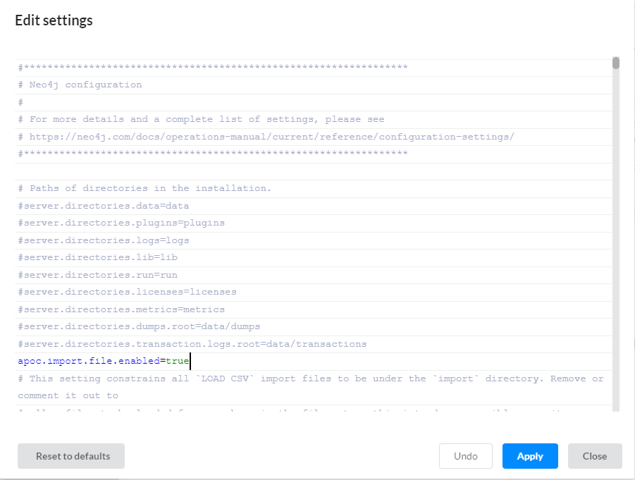

# Introduction to Neo4j

The following section is a transcription of the [Neo4j in 100 seconds](https://www.youtube.com/watch?v=T6L9EoBy8Zk) video.

Although Neo4j is not the only graph database, at the moment it is the product most commonly used. Neo4j is an ACID complaint graph database, that can handle the extremely complex relational data of the modern world. Created in 2007 by [Emil Eifrem](https://www.linkedin.com/in/emileifrem), is written in Java and pioneered the property graph model.

Traditional relational databases use a tabular model, but joining normalized tables together is not how real humans think about relationships. Naturally we think about connections between entities, for example: Bob asked a question on StackOverflow, then Alice and Chad downvoted it, so Bob gave up his dream of programming. A graph can model this data the same way you might visualize it on a whiteboard.


Nodes represent entities, edges represent relationships between entities, and properties are key-valued pairs that store data on these objects. Under the hood Neo4j is a true native graph database that applies this model all the way down to the storage level. Queries are written in a declarative language called **Cypher** that resembles **SQL**, except nodes are surrounded by parentheses and then connected to other nodes with arrows via relationships and brackets. 

Today Neo4j is used in applications like recommendation engines, social media platforms, and knowledge graphs for artificial intelligence, and just to name a few. To get started it can be self-hosted with [Docker](https://neo4j.com/docs/operations-manual/current/docker/), but the easiest approach is to sign up for [Aura](https://neo4j.com/docs/aura/) which provides a free fully managed database in the cloud. 

From there we can build the next Twitter by making queries with cypher. Use the `CREATE` clause followed by parentheses to create a new entity or node, this node should be provided a proper name to identify it next to the `:` sign. Inside braces, we can add key-value pairs to represent the data on that node. To establish a connection between nodes we can represent a relationship inside the brackets, the arrow then points to another node.

```javascript
CREATE (:User {name: "@Alice"})-[:FOLLOWS]->(:User {name: "@Hank"})
```

That's all it takes to create relational data, no foreign keys or join tables are required, although we can add constraints to the schema. Like this:

```javascript
CREATE CONSTRAINT ON (user:User) ASSERT user.name IS UNIQUE
```

Cypher allows us to define local variables on the query then return them from the statement to get the data back as the result. The result of the query can be then used in subsequent queries. Using Aura we can visualize our data as an interactive graph or even as a table.

Now to continue building our Twitter we can connect multiple tweet nodes to a user. 

```javascript
CREATE (:User {name: "@Alice"})-[:SAYS]->(:Tweet {
    text: "Love Neo4j",
    created_at: date("2024-07-08")})
```

We also need a query that will return all the tweets from all the users that are being followed. This can be easily represented with nodes and relationships, but we can also filter this query with a `WHERE` clause to only return tweets that were posted recently. In addition, we can match on string patterns and regular expressions, or filter on complex patterns based on the graph itself, like only return tweets from users that have not been muted.

```javascript
MATCH (u:User)-[:FOLLOWS]->(:User)--(t:Tweet)
WHERE user.name = "@Alice" 
    AND t.text =~ "(?1)Neo4j.*" 
    AND t.created_at > date("2024-07-08")
    AND NOT (u)-[:MUTED]->(:User)
RETURN user.name, otherUser.name
```

So not only is it intuitive for developers, but it also allows patterns in your data to emerge naturally, which is a huge advantage when it comes to data analysis and machine learning.

## How Neo4j implements the graph paradigm

Nodes are schema-less entities with properties, they can have zero or more labels tagged on them. Without labels all nodes would be alike, and it would take more effort to see the difference between them. By labelling nodes, we can make groups, or sets of nodes, so we can easily and efficiently query them. Labels can be used for other purposes such as state of a node. Remind that labels can be added and removes dynamically.

In Neo4j, a node always have an implicit property with the ID of the node that is an auto-incrementing integer (use the internal `ID()` function to retrieve the ID of a node or relationship). You are not tied to that behavior, however, you could configure a node to use another property as its ID.

Now that we covered labels, let's move on and detail a few more about properties.

Properties are key-valued pairs. The name of the property is a **key**, which is always a string. The **value** is a primitive data type. With an **index**, a dictionary is kept up to date. So that with a query that looks for actors with a certain name, not all properties have to be searched, but just the dictionary. This way the query becomes much faster.

But wait a minute, if a node is a schema-less, so how it's possible to have an actor node without a name property? In that case, the node is just not indexed.

It's also possible to add a unique constraint to a property in a node. If the property is given an empty value, the constraint just doesn't apply.

Here is a list of primitive data types supported by Neo4j. But when you set a value of a property in a query, the value is automatically set to an appropriate data type.

- Boolean
- String (Unicode)
- Integer
- Float
- Time
- DateTime
- Point (Spatial)
- Path
- Duration
- Arrays

When the value changes later, the data type is changed if needed. And **null** values are not applicable in Neo4j. When you don't want a property to have a value, you can just omit it.

Now talking about relationships. They must have a name, and be directed from one node to another. They also can contain properties, and support indexing as well.

## Exploring the desktop app

The desktop app is available only for Windows. The developer license grants you one year to explore the features available on enterprise edition.

Once you open the Neo4j app, there is a tab related to projects. A project can contain one or multiple graph databases, although only one database can be active at a time. A project could, for example, be an app you're developing.

To create a new graph database click on the **Add** button, a pop-up will show up with the following options *Local DBMS*, *Remote Connection*, and *File*.

Remote connection option indicates that you want to connect to another Neo4j server that has a graph, for now let's stick to the Local DBMS option.


After a few moments, your new graph is there, but it's still empty. The next step is to import the [datafile](./assets/chapter_02/drwho.graphml) into the graph. But before that, navigate to the plugin section where you can install all kinds of add-ons that can be enabled for the whole project. Install APOC, which stands for *Awesome Procedures On Cypher*. It is a library that adds stored procedures and functions to the ones that come out of the box. And we need one of the procedures do import the data.


When APOC is installed, open the Settings of the drWho DBMS graph to include the following line:

```bash
apoc.import.file.enabled=true
```



After hitting the Apply button, click on the three dots next to the graph name, go to Open Folder > Import. Copy the [datafile](./assets/chapter_02/drwho.graphml) to that folder.


Press the start button. An error will raise.


Open the logs and check what's wrong. In this case it happens that we misconfigured the server, as described in the log file:

```log
1 issue found.
Error: Setting 'apoc.import.file.enabled' for APOC was found in the configuration file. In Neo4j v5, APOC settings 
must be in their own configuration file called apoc.conf. Cleanup the config or disable 
'server.config.strict_validation.enabled' to continue.
```

So create the `/conf/apoc.conf` file, containing that line corresponding to APOC (remove it from the neo4j.config file). You can easily find that folder by navigating to Open Folder > DBMS.

```bash
apoc.import.file.enabled=true
```

If everything went well, you should be able to open the graph in Neo4j, a new window should pop up where you must enter the password used when creating the DBMS.

Now go to the Apps tab, and open the browser to start console and run the following command:


```bash
CALL apoc.import.graphml('drwho.graphml', {batchSize: 10000, storeNodeIds: false, readLabels: true})
```

You should get an output similar to this:


In the top-left corner there's a button that gives you an overview of the current database. You can see all the labels present in the database, as well as all the relationships types and the properties. Further down, you'll see information about the connected graph.


Below there is a favorite button, where you can save queries that will show up here. You can drag and drop text files on the canvas to save it.


The next button regards to information and guidance.

You can explore the graph nodes and relationships properties interactively!


You can even export the current graph.


And alternate the visualization of the graph!


